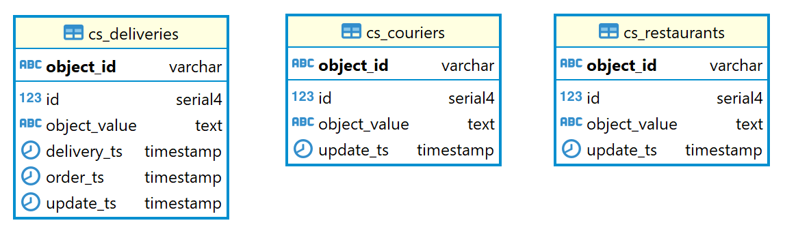
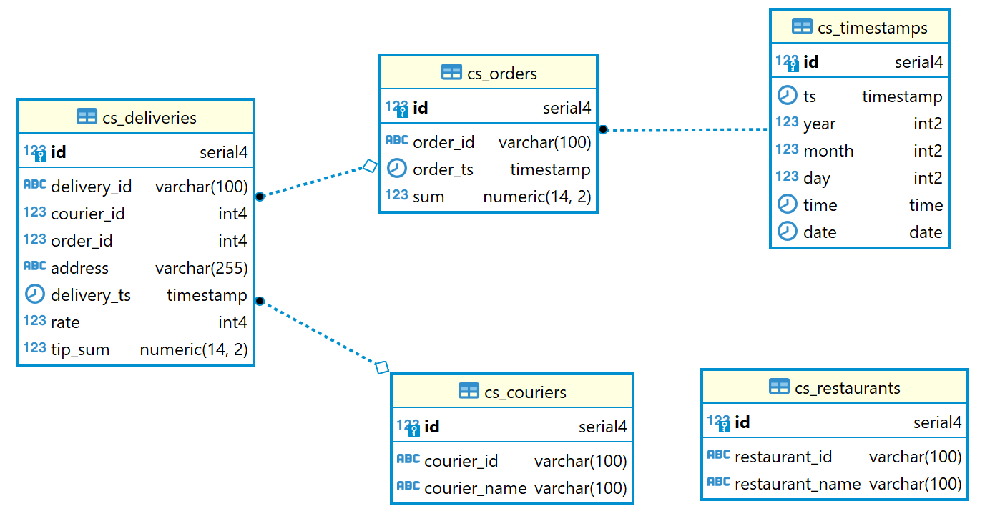
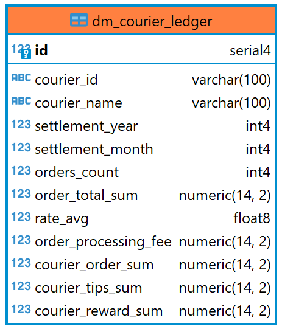

# Проект 5-го спринта

### Описание задачи
Требуется реализовать витрину для расчётов с курьерами, в которой необходимо рассчитать суммы оплаты каждому курьеру за месяц.

### Источники данных
Источником данных является система курьерской службы, которая
предоставляет HTTP API со следующими методами:
* /restaurants
* /couriers
* /deliveries

### Структура STG-слоя
Диаграмма STG-слоя (скрипт src/sql/ddl/create_cs_stg_schema.sql):

### Структура DDS-слоя
Диаграмма DDS-слоя (скрипт src/sql/ddl/create_cs_dds_schema.sql):

### Структура CDM-слоя
Диаграмма CDM-слоя (скрипт src/sql/ddl/create_cs_cdm_schema.sql):

